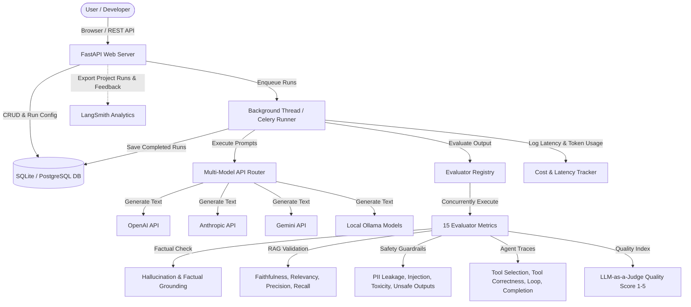

# AgentEval — Agent & RAG Evaluation Platform

Many developers build LLM applications, but few build the evaluation pipelines necessary to ensure their quality. **AgentEval** is a senior-grade, production-ready evaluation platform built with FastAPI, PostgreSQL/SQLite, and a glassmorphic dashboard frontend. It benchmarks model performance, RAG retrieval quality, safety guardrails, and agentic tool-use loops across multiple commercial and local LLMs (OpenAI, Gemini, Anthropic, and Ollama).

---

## 🏗️ System Architecture

The following diagram illustrates the workflow and architecture of the Agent Evaluation Platform:



---

## 🌟 Key Features

1. **Multi-Model Evaluation & Leaderboards**: Side-by-side benchmarking of models including GPT-4o, Claude 3.5 Sonnet, Gemini 1.5 Pro, and local Llama 3 models via Ollama. It tracks average scores, latency metrics, and API spending tables.
2. **15 Modular Evaluator Metrics**:
   - **Factual Grounding**: Hallucination detection (0-1) and grounding checks.
   - **RAG Verification**: Faithfulness, Answer Relevancy, Context Precision, and Context Recall.
   - **Safety Guardrails**: PII leakage scanner, Prompt Injection checker, Toxicity classifier, and Unsafe Output advice detection.
   - **Agent Loop Analysis**: Tool selection matches, tool call argument correctness (LLM-judge), infinite loop detector (fails if >=3 repeated sequences), and task completion validator.
   - **Response Quality**: 1-5 general quality scoring (LLM-as-a-judge).
3. **Prompt Template Versioning**: A version history sidebar interface where you can draft new prompt templates, auto-increment versions in the database, and visually compare any two versions side-by-side.
4. **Bulk Dataset Import**: Drag-and-drop CSV/JSON loader in the dataset view to upload hundreds of test cases instantly.
5. **LangSmith Integration**: Standard export pipeline that creates matching datasets in LangSmith, syncs test cases, logs evaluations, and tags metrics as feedback scores.
6. **Self-Seeding Startup Routine**: Installs SQLite databases and seeds 3 sample datasets (Finance, Healthcare, Customer Support), default prompt templates, and 8 historical model evaluation runs on initial start.

---

## 🛠️ Getting Started

### Prerequisites
- Python 3.11 (via Conda/Miniconda or standalone)
- *Optional*: Docker & Docker Compose (for running PostgreSQL and Redis services)

### Option A: Local Run (Graceful SQLite & Thread Fallback)
If local services like PostgreSQL or Redis are not running, the platform automatically switches to a local SQLite database and spawns synchronous background threads for task executions.

1. **Clone the repository** and navigate to the project directory:
   ```bash
   cd "Agent Evaluation Platform"
   ```
2. **Configure Environment Variables**:
   Copy the `.env` template and input your API keys:
   ```bash
   # In .env
   OPENAI_API_KEY=your_openai_key
   GEMINI_API_KEY=your_gemini_key
   LANGCHAIN_TRACING_V2=true  # Enable if using LangSmith
   LANGCHAIN_API_KEY=your_langsmith_key
   ```
3. **Install Dependencies**:
   ```bash
   python -m pip install -r requirements.txt
   ```
4. **Launch the FastAPI Server**:
   ```bash
   python -m uvicorn backend.app.main:app --reload --host 127.0.0.1 --port 8000
   ```
5. Open your browser and navigate to `http://127.0.0.1:8000` to access the dashboard.

### Option B: Running via Docker Compose (Postgres + Redis Celery worker)
1. Ensure your `.env` contains valid credentials.
2. Build and run containers:
   ```bash
   docker-compose up --build
   ```
3. Access the server at `http://localhost:8000`.

---

## 🧪 Testing

Run the full integration test suite containing dataset lifecycles, evaluator registry checks, and CSV/JSON importers:
```bash
# Set database environment variable to SQLite for isolated run
$env:DATABASE_URL="sqlite:///./test.db"
python -m pytest backend/tests/
```

---

## 🔌 API Endpoints Summary

- **Datasets**:
  - `GET /api/datasets` — Retrieve all datasets
  - `POST /api/datasets` — Create a new test case suite
  - `POST /api/datasets/{dataset_id}/import` — Upload CSV/JSON file to bulk-import test cases
- **Prompts**:
  - `GET /api/prompts` — Fetch prompt templates
  - `POST /api/prompts` — Add new template text (auto-increments version number)
- **Evaluations**:
  - `POST /api/evaluations/run` — Queue background evaluation run (Celery/Thread)
  - `GET /api/evaluations/runs` — Fetch runs execution history
  - `POST /api/evaluations/quick-check` — Instant playground evaluation (synchronous)
- **Leaderboards**:
  - `GET /api/leaderboards/models` — Aggregated ranks for LLM models
  - `GET /api/leaderboards/prompts` — Ranks for system prompts
  - `GET /api/leaderboards/datasets` — Pass rates for datasets
